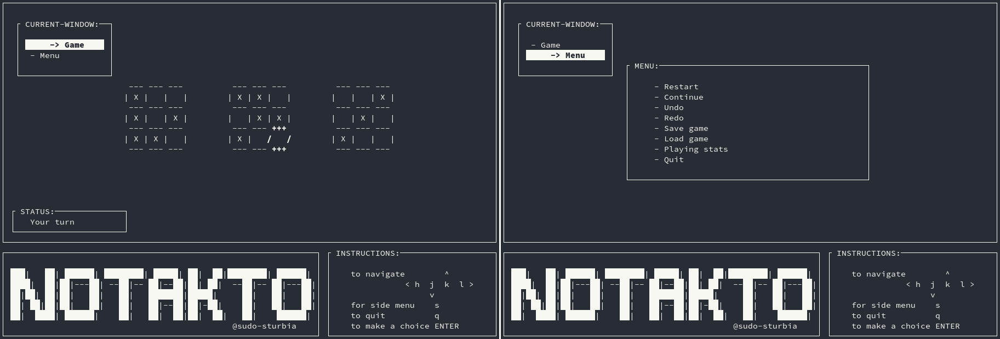

# notakto
> 3-board notakto in C and ncurses.

## Contents
- [What is notakto?](#info)
- [Installing](#install)
- [Features](#features)

## What is notakto? 
Notakto is tic tac toe where both players use the same symbol, **X**.

The objective of the game is to avoid making three Xs in a row (vertical, horizontal or diagonal.)

Play ends when every board has **three-in-a-row**. The player that completes the **last** three-in-a-row on the last board is the **loser**.

For more about game strategy and how to play, check [The Secrets of Notakto: Winning at X-only Tic-Tac-Toe](https://arxiv.org/pdf/1301.1672.pdf)

## Installing 
1. Install `ncurses` library, in Debian / Ubuntu : 

    `[sudo] apt install libncurses5-dev`

2. Clone repositry:

    `git clone https://github.com/sudo-sturbia/notakto.git`

3. Compile game using makefile:
    
    `cd notakto/src && make`

4. Finally, to play:

    `./notakto`

## Features 
### Modes
The game features two playing modes

- TWO PLAYERS: where two users can challenge each other.
- PLAY vs THE MACHINE: where you can test your skills against a ***playing engine*** created for the game.

### Controls
- <kbd>h</kbd> <kbd>j</kbd> <kbd>k</kbd> <kbd>l</kbd> or <kbd><</kbd> <kbd>v</kbd> <kbd>^</kbd> <kbd>></kbd> for movement.
- <kbd>s</kbd> to use side menu (used for moving between windows).
- <kbd>q</kbd> to quit.

### Supported features
Other supported features include:

- Saving / Loading for unlimited number of games.
- Undo / Redo for any move throughout the game.
- Detection & handling of terminal resizing.
- Display playing stats for session.

Options are available through the menu.
